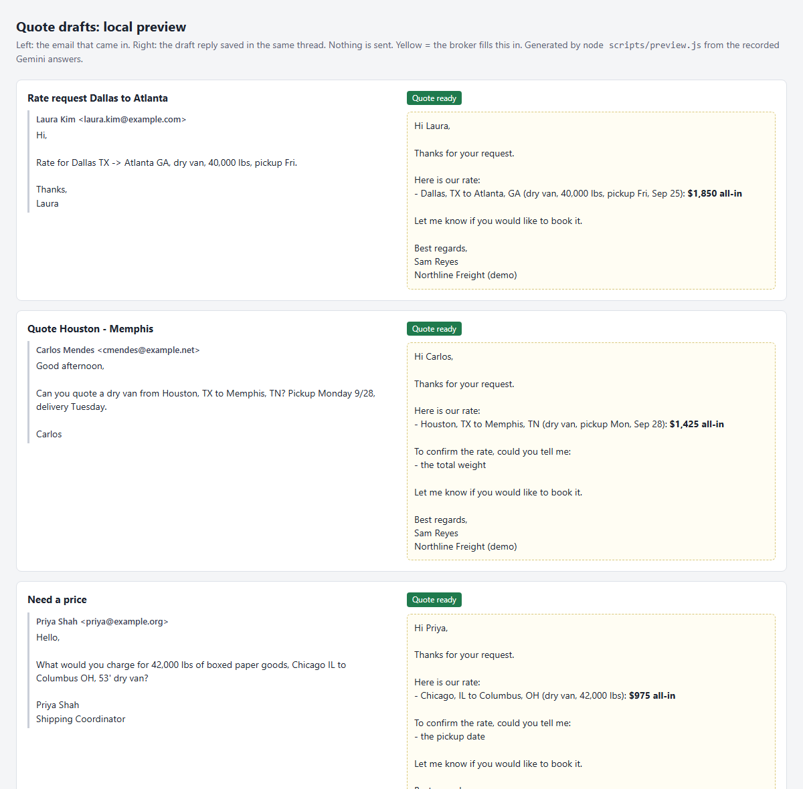
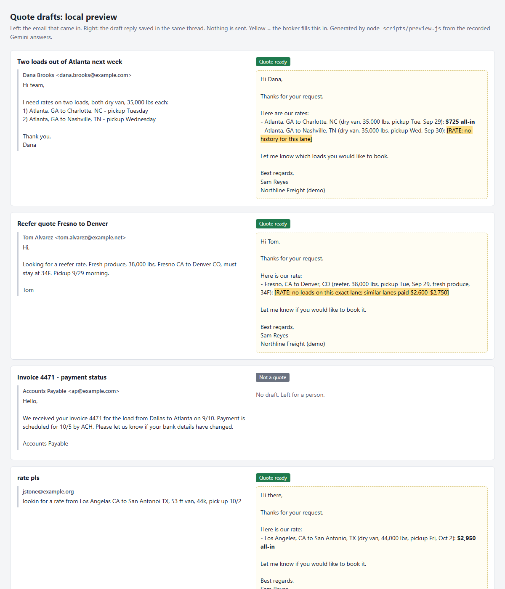

# freight-quote-drafts

A Google Apps Script for small US freight brokers. Every 5 minutes it reads new
rate requests in a shared inbox (quotes@, info@), pulls out the lane details
with an AI model, looks up what the broker charged on that lane before, and
saves a **draft reply in the same Gmail thread** with the label `Quote ready`.

It never sends anything. A person always opens the draft, checks it, fills in any
`[RATE: ...]` note, and presses Send.

```
new email ──> AI reads it ──> JSON: origin, destination, equipment, weight, pickup date
                                   │
                                   ├─ not a rate request ─> label "Not a quote", no draft
                                   │
                                   └─> "Rate history" sheet ─> draft reply in the thread
                                        exact lane: median of the last 5 loads   + label "Quote ready"
                                        same states only: range, for the broker  + row in "Log" sheet
                                        nothing: [RATE] placeholder
                                        missing details: polite questions in the same draft
```



The harder cases: two lanes in one email, a lane with only similar history,
an invoice that must be skipped, and a request full of typos.



These pictures are rendered locally from the real model answers
(`node scripts/preview.js`), not taken in Gmail.

## What is verified, and how

| Claim | How | Result |
|---|---|---|
| The model reads all 10 test emails correctly | `scripts/live-eval.js`: real Gemini API, the same prompt the script uses, compared field by field with answers written by hand before the first run | **10/10** on `gemini-2.5-flash` — [`docs/live-eval.txt`](docs/live-eval.txt); also 10/10 on `gemini-3.8-flash` in an earlier run |
| Rates, questions and the reply text are right for each email | `npm test` on the recorded model answers | 20 tests |
| Every quote email gets one draft in its own thread + `Quote ready`; the invoice gets `Not a quote`; nothing is sent | `npm test`: `Main.gs` runs against a fake Gmail and Sheets where any send, reply or forward throws | 9 tests |
| A second run does not create duplicate drafts or call the model again | same | test |
| Model down (HTTP 503) → no label, logged, retried 5 minutes later; after 3 failures left for a person | same | 2 tests |
| Label fails after the draft is saved → still no second draft | same | test |
| Customer writes again in a thread that already has a draft → a new draft | same | test |
| Busy inbox: 27 requests at once → 20 in the first run (oldest first), 7 in the next | same | test |
| The tests catch real mistakes | broke the equipment check, the "we wrote last" check and the duplicate-draft guard on purpose | each made tests fail |

```bash
npm test          # 29 tests, no network, no Google account
```

Not verified yet: the run inside a real Gmail account. The Gmail and Sheets
calls are standard Apps Script services, but until they run in a live account
they are covered only by the fakes above.

## The 10 test emails

All invented. Addresses use the reserved `example.com/.net/.org` domains, phone numbers are `555-01xx`.

| # | What it tests | Expected result |
|---|---|---|
| 1 | Full request, "pickup Fri" | $1,850, Fri Sep 25 |
| 2 | No weight | $1,425 + asks for the weight |
| 3 | No pickup date | $975 + asks for the date |
| 4 | Two lanes in one email | $725 for one, `[RATE]` for the other |
| 5 | Reefer, no loads on this exact lane | range from similar lanes, for the broker |
| 6 | Flatbed; history has only a dry van on this lane | `[RATE]`, the dry van price is not used |
| 7 | Invoice question, not a rate request | skipped, no draft |
| 8 | Reply in a thread: weight comes in the third message | $675, uses the whole thread |
| 9 | Signature with an address and phone numbers | signature ignored, $825 |
| 10 | "Los Angelas", "San Antonoi", "53 ft van", "44k" | Los Angeles → San Antonio, dry van, 44,000 lbs, $2,950 |

## Setup for a broker

1. Open the shared Google Sheet and click **File → Make a copy**.
2. In the copy: **Quote Assistant → Setup**, then **Allow**, then paste the API key when asked.
3. Replace the sample rows in **Rate history** with your own lanes and rates.
   Put your name and company in **Settings**.

From then on the script checks the inbox every 5 minutes. Every email it
handles is one row in the **Log** sheet.

## Try it from the source

1. Create a Google Sheet, open **Extensions → Apps Script**.
2. Copy `src/Core.gs`, `src/Main.gs`, `src/DemoData.gs` into three script files.
   In **Project Settings** turn on "Show appsscript.json" and paste `src/appsscript.json`
   (it turns on the Gmail API used to load the demo emails).
3. Reload the sheet: **Quote Assistant → Setup** (asks for a Gemini API key), then
   **Quote Assistant → Load demo emails**. This puts the 10 test emails straight into
   the inbox without sending anything.
4. **Quote Assistant → Check inbox now**, or wait up to 5 minutes.

Use a test Gmail account and invented emails only: the free Gemini tier may use
what you send it to improve Google's products.

The free tier also has a small daily limit: on 26.09.2026 it was 20 requests per
day per model (`GenerateRequestsPerDayPerProjectPerModel-FreeTier`). One email is
one request, so a demo run of 10 emails can be repeated about once a day. The
model is set in the **Settings** sheet.

## How it is built

- `src/Core.gs` — prompt, reading the model answer, rate lookup, reply text. No Google services, so it runs in Node tests as is.
- `src/Main.gs` — menu, setup, the 5-minute trigger, Gmail and Sheets.
- `callModel()` in `Main.gs` is the only place that talks to the AI. To move to a proxy or another provider, change that one function.
- `test/gas.js` loads the `.gs` files into one shared scope, the way Apps Script does.

## What the AI sees

The text of the last few messages in the thread, without quoted replies.
No sheet data, no attachments, no other emails. The rate history stays in the sheet.

## Limits

- The rate is a lookup of what you charged before, not a market rate. Lanes with no history get a `[RATE]` placeholder.
- Cities are matched by name. "Dallas" and "Fort Worth" are different lanes.
- Up to 20 new emails per run, 7 seconds apart, to stay inside the free Gemini limits. More wait for the next run.
- Only the last 2 days of the inbox are checked.

## License

MIT
