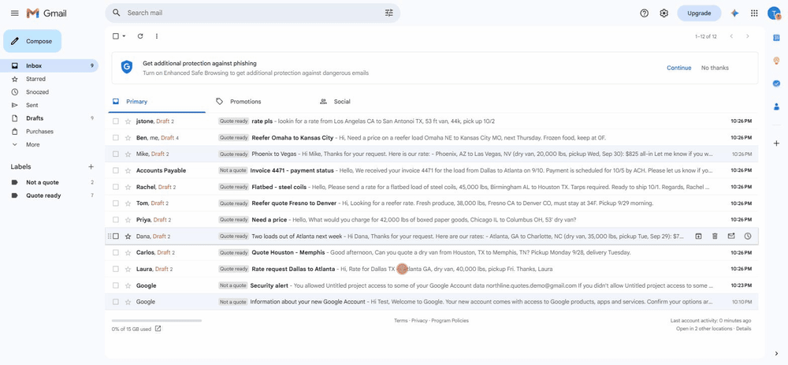
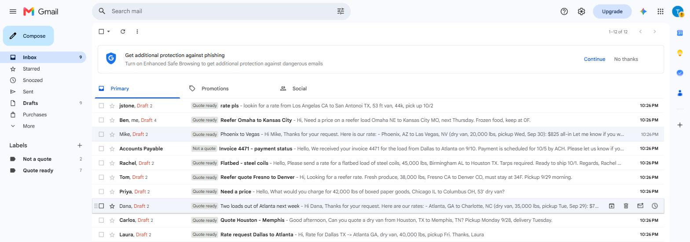
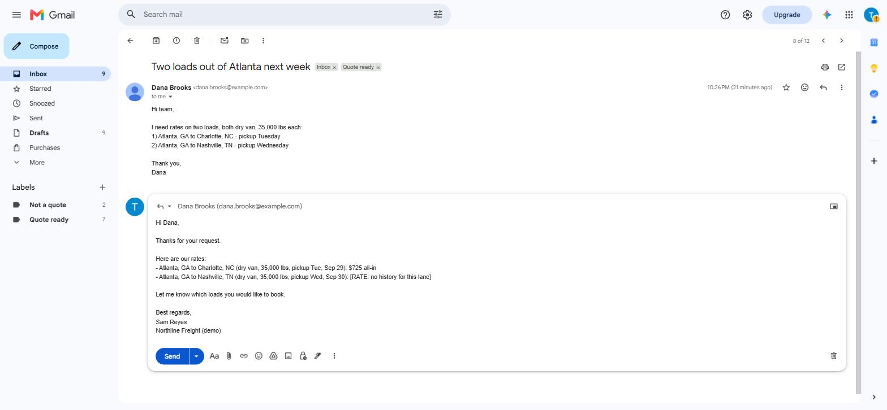

# freight-quote-drafts

A Google Apps Script for small US freight brokers. Every 5 minutes it reads new
rate requests in a shared inbox (quotes@, info@), pulls out the lane details
with an AI model, looks up what the broker charged on that lane before, and
saves a **draft reply in the same Gmail thread** with the label `Quote ready`.

It never sends anything. A person always opens the draft, checks it, fills in any
`[RATE: ...]` note, and presses Send.

```
new email ──> AI reads it ──> JSON: origin, destination, equipment, weight, pickup date
                                   │
                                   ├─ not a rate request ─> label "Not a quote", no draft
                                   │
                                   └─> "Rate history" sheet ─> draft reply in the thread
                                        exact lane: median of the last 5 loads   + label "Quote ready"
                                        same states only: range, for the broker  + row in "Log" sheet
                                        nothing: [RATE] placeholder
                                        missing details: polite questions in the same draft
```



A live run in a test Gmail account on 26.09.2026: 10 test emails in, 9 drafts
saved in their own threads with the label `Quote ready`, the invoice labelled
`Not a quote`. Nothing was sent.



Two lanes in one email: a rate for the lane with history, a `[RATE]` note for the
lane without it.



All 10 emails side by side, rendered locally from the recorded model answers
(`node scripts/preview.js`): [`docs/preview.png`](docs/preview.png),
[`docs/preview-hard.png`](docs/preview-hard.png).

## What is verified, and how

| Claim | How | Result |
|---|---|---|
| The model reads all 10 test emails correctly | `scripts/live-eval.js`: real Gemini API, the same prompt the script uses, compared field by field with answers written by hand before the first run | **10/10** on each of `gemini-2.5-flash`, `gemini-flash-latest` (3.8-flash) and `gemini-flash-lite-latest` (3.5-flash-lite) — [`docs/live-eval.txt`](docs/live-eval.txt) |
| Rates, questions and the reply text are right for each email | `npm test` on the recorded model answers | 20 tests |
| Every quote email gets one draft in its own thread + `Quote ready`; the invoice gets `Not a quote`; nothing is sent | `npm test`: `Main.gs` runs against a fake Gmail and Sheets where any send, reply or forward throws | 12 tests |
| A second run does not create duplicate drafts or call the model again | same | test |
| Model down (HTTP 503) → no label, logged, retried 5 minutes later; an answer the script cannot read → 3 attempts, then left for a person | same | 3 tests |
| Label fails after the draft is saved → still no second draft | same | test |
| Customer writes again in a thread that already has a draft → a new draft | same | test |
| Busy inbox: 27 requests at once → 20 in the first run (oldest first), 7 in the next | same | test |
| The tests catch real mistakes | broke the equipment check, the "we wrote last" check and the duplicate-draft guard on purpose | each made tests fail |

```bash
npm test          # 44 tests, no network, no Google account
```

**Live run in Gmail (26.09.2026).** A new Gmail account, the three `.gs` files
pasted into a sheet's script, **Setup**, **Load demo emails**, then the
5-minute trigger. Result: 9 drafts, each in its own thread, `Quote ready` on
each, the invoice and two Google notices labelled `Not a quote`. The Sent folder
holds one message: the broker's earlier question from test email 8, put there by
the demo loader, not sent. Running **Check inbox now** again right after created nothing new.

What the live run found that the tests did not:
- `gemini-2.5-flash` answers 404 to a new API key ("no longer available to new
  users"). The default model is now `gemini-flash-latest`.
- The free tier answered 503 ("high demand") and 429 (daily limit) during the
  run. The script used to count these as failed attempts and give up on an email
  after 3; now a service error stops the run and the email waits for the next one.

## The 10 test emails

All invented. Addresses use the reserved `example.com/.net/.org` domains, phone numbers are `555-01xx`.

| # | What it tests | Expected result |
|---|---|---|
| 1 | Full request, "pickup Fri" | $1,850, Fri Sep 25 |
| 2 | No weight | $1,425 + asks for the weight |
| 3 | No pickup date | $975 + asks for the date |
| 4 | Two lanes in one email | $725 for one, `[RATE]` for the other |
| 5 | Reefer, no loads on this exact lane | range from similar lanes, for the broker |
| 6 | Flatbed; history has only a dry van on this lane | `[RATE]`, the dry van price is not used |
| 7 | Invoice question, not a rate request | skipped, no draft |
| 8 | Reply in a thread: weight comes in the third message | $675, uses the whole thread |
| 9 | Signature with an address and phone numbers | signature ignored, $825 |
| 10 | "Los Angelas", "San Antonoi", "53 ft van", "44k" | Los Angeles → San Antonio, dry van, 44,000 lbs, $2,950 |

## Setup for a broker

1. Open the shared Google Sheet and click **File → Make a copy**.
2. In the copy: **Quote Assistant → Setup**, then **Allow**, then paste the API key when asked.
3. Replace the sample rows in **Rate history** with your own lanes and rates.
   Put your name and company in **Settings**.

From then on the script checks the inbox every 5 minutes. Every email it
handles is one row in the **Log** sheet.

## Try it from the source

1. Create a Google Sheet, open **Extensions → Apps Script**.
2. Copy `src/Core.gs`, `src/Main.gs`, `src/DemoData.gs` into three script files.
   In **Project Settings** turn on "Show appsscript.json" and paste `src/appsscript.json`
   (it turns on the Gmail API used to load the demo emails).
3. Reload the sheet: **Quote Assistant → Setup** (asks for a Gemini API key), then
   **Quote Assistant → Load demo emails**. This puts the 10 test emails straight into
   the inbox without sending anything.
4. **Quote Assistant → Check inbox now**, or wait up to 5 minutes.

Use a test Gmail account and invented emails only: the free Gemini tier may use
what you send it to improve Google's products.

The free tier also has a small daily limit: on 26.09.2026 it was 20 requests per
day per model (`GenerateRequestsPerDayPerProjectPerModel-FreeTier`). One email is
one request, so a demo run of 10 emails can be repeated about once a day. The
model is set in the **Settings** sheet; each model has its own limit, so switching
to `gemini-flash-lite-latest` gives another 20. `gemini-2.5-flash` is closed to new
API keys ("no longer available to new users", seen 26.09.2026).

When the AI service is busy (HTTP 503) or out of quota (429), the run stops after
that one call and the email is tried again 5 minutes later. Such failures never
count toward the 3 attempts; only an answer the script cannot read does.

## How it is built

- `src/Core.gs` — prompt, reading the model answer, rate lookup, reply text. No Google services, so it runs in Node tests as is.
- `src/Main.gs` — menu, setup, the 5-minute trigger, Gmail and Sheets.
- `callModel()` in `Main.gs` is the only place that talks to the AI. To move to a proxy or another provider, change that one function.
- `test/gas.js` loads the `.gs` files into one shared scope, the way Apps Script does.

## quote-proxy: the paid setup

In the demo the sheet calls Gemini with its own key. For a paying broker the sheet
holds only a **client token**; `callModel()` sends the prompt to `quote-proxy`, a
Cloudflare Worker ([`proxy/`](proxy)) that holds the AI key and decides whether to
answer.

```
sheet (Client token) ──{prompt}──> quote-proxy ──> Gemini or Claude
                                     │ unknown token        → 401
                                     │ paused by me         → 403 "service paused - contact Dmytro"
                                     │ paid_until passed    → 402 same message
                                     │ client's daily limit → 429 same message
                                     │ all clients' limit   → 503 same message
```

The sheet treats every refusal like a busy AI: no draft, the message goes to the
**Log** sheet, the email is tried again on the next run.

- The AI key is a Worker secret (`wrangler secret put AI_KEY`). Clients never see it.
- KV keeps token hashes, client settings and daily counters. Email text is never
  logged or stored: a test sends a marked prompt through success, provider failure
  and a bad token, and fails if the marker shows up in console output, KV or any reply.
- `PROVIDER = "gemini"` (free, tests) or `"anthropic"` (`claude-haiku-4-5`), one variable.
- Clients are managed from the command line, no web page:

```bash
node proxy/admin.js add "Acme Freight" 200 2026-10-31   # prints the token once
node proxy/admin.js pause "Acme Freight"
node proxy/admin.js list
node proxy/admin.js push                                # prints the upload command
```

**What a runaway client can cost.** Measured on the 10 test emails: the prompt is
about 1,700 characters (roughly 450 tokens), the answer up to 560 characters
(roughly 150 tokens). At Claude Haiku 4.5 prices ($1 per million input tokens,
$5 per million output) that is about $0.0013 per email; a long thread (4 messages of
4,000 characters, the most the script sends) is about $0.005. With a limit of 200
emails a day, one client costs at most about $1 a day, usually about $0.25; the
global limit (1,000 a day by default) caps all clients together at about $5 a day.

Before switching `PROVIDER` to `anthropic`: set a monthly spend limit in the
Anthropic Console and keep auto-reload off, so a bug can stop the service but cannot
run up a bill.

Checked locally: 12 proxy tests (every guard also broken on purpose to see its test
fail) and one real Gemini call through the Worker code. Not yet deployed to
Cloudflare; the KV counters are not atomic, so two requests in the same instant can
both pass the last free slot.

## What the AI sees

The text of the last few messages in the thread, without quoted replies.
No sheet data, no attachments, no other emails. The rate history stays in the sheet.

## Limits

- The rate is a lookup of what you charged before, not a market rate. Lanes with no history get a `[RATE]` placeholder.
- Cities are matched by name. "Dallas" and "Fort Worth" are different lanes.
- Up to 20 new emails per run, 7 seconds apart, to stay inside the free Gemini limits. More wait for the next run.
- Only the last 2 days of the inbox are checked.

## License

MIT
